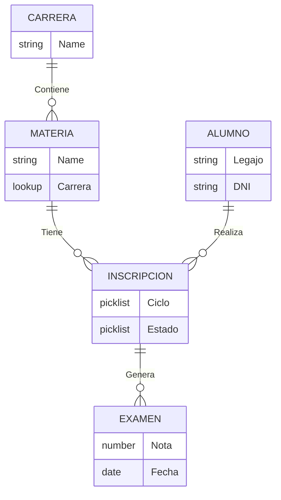

# 📝 Tarea: Relación entre Objetos

**Rol Responsable**: 🏗️ **Salesforce Consultant**
**Referencia**: HU-003, HU-004
**Destino en Gestor**: [`02-Salesforce_Consultant.md`](../../Gestor_de_Versiones/02-Salesforce_Consultant.md)

## Diseño de Arquitectura de Datos (ERD)

Mi trabajo es asegurar que los objetos "hablen" entre sí para cumplir con **[REQ-DATA-002] Historial Académico**.

### 📊 Esquema Relacional

*Nota: Se adjunta diagrama lógico y versión texto por compatibilidad.*

#### Opción A: Código Mermaid (Requiere Extension)


#### Opción B: Diagrama Lógico (Texto)
Si no visualizas el gráfico de arriba, esta es la jerarquía:

```text
[ CARRERA ]
     |
     +---<tiene>---( MATERIA )
                        |
                        +---<tiene>---( INSCRIPCION )---<realiza>---[ ALUMNO ]
                                            |
                                            +---<genera>---( EXAMEN )
```

**Explicación de Cardinalidad:**
1.  **Carrera --(1:N)--> Materia**: Una carrera tiene muchas materias.
2.  **Materia --(1:N)--> Inscripción**: Una materia tiene muchos inscritos.
3.  **Alumno --(1:N)--> Inscripción**: Un alumno tiene muchas inscripciones.
4.  **Inscripción --(1:N)--> Examen**: Una inscripción tiene varios exámenes (Parciales/Finales).

---

### 1. Modelo de Inscripción (Junction Object)
El requerimiento [REQ-DATA-002] dice: *"Un alumno cursa muchas materias, una materia tiene muchos alumnos e historial"*.
*   **Solución**: Relación `Many-to-Many`.
*   **Objeto Intermedio**: `Inscripcion__c`.
*   **Relaciones**:
    1.  `Inscripcion__c` ➡️ **Master-Detail** ➡️ `Alumno__c`.
    2.  `Inscripcion__c` ➡️ **Master-Detail** ➡️ `Materia__c`.

### 2. Modelo de Exámenes (Evaluación Continua)
Responde a **[REQ-FUNC-001] Ciclo de Exámenes**.
*   **Relación**: `Examen__c` ➡️ **Master-Detail** ➡️ `Inscripcion__c`.
*   **Justificación**: Un examen no existe sin una inscripción activa.

### 3. Carrera - Materia
*   **Relación**: `Materia__c` ➡️ **Lookup** ➡️ `Carrera__c`.
*   **Justificación**: Facilita [REQ-SEC-002], permitiendo reasignar materias sin perder integridad.

---
**Validación**: Esquema 100% compliant con REQ-DATA-002.
