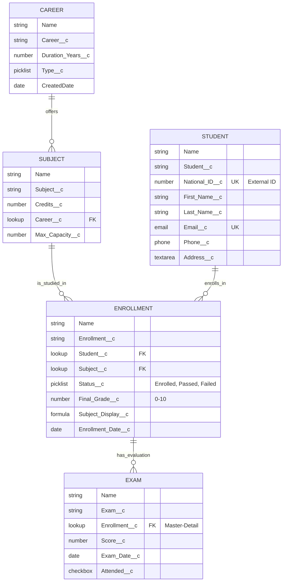

# 🗂️ Diagrama ERD: Modelo de Datos Lumina Tech

## Leyenda de Relaciones

| Relación | Tipo | Descripción |
|----------|------|-------------|
| **Career → Subject** | Master-Detail | A Subject belongs to a Career |
| **Student → Enrollment** | Master-Detail | Enrollment depends on Student |
| **Subject → Enrollment** | Master-Detail | Enrollment depends on Subject |
| **Enrollment → Exam** | Master-Detail | Exams are part of an Enrollment |

## Leyenda de Tipos de Campo

- **string**: Texto
- **number**: Número
- **picklist**: Lista de valores
- **date**: Fecha
- **email**: Email
- **phone**: Teléfono
- **text**: Texto largo
- **lookup**: Relación (FK = Foreign Key)
- **formula**: Campo calculado
- **UK**: Unique Key (campo único)

## Validaciones Clave

1. **National ID**: Unique in the system
2. **Email**: Unique and strictly formatted as `@lumina.edu`
3. **Final Grade**: Strictly between 0.00 and 10.00
4. **Status**: Picklist based (Enrolled, Passed, Failed) - No auto-calculation yet (Sprint 2)

## Referencias

- **Guía de Objetos**: [01-Tutorial_Carrera.md](../Guias_Implementacion/01-Tutorial_Carrera.md)
- **Guía de Relaciones**: [04-Tutorial_Inscripcion.md](../Guias_Implementacion/04-Tutorial_Inscripcion.md)
- **Schema Builder**: [09-Tutorial_Schema_Builder.md](../Guias_Implementacion/09-Tutorial_Schema_Builder.md)
