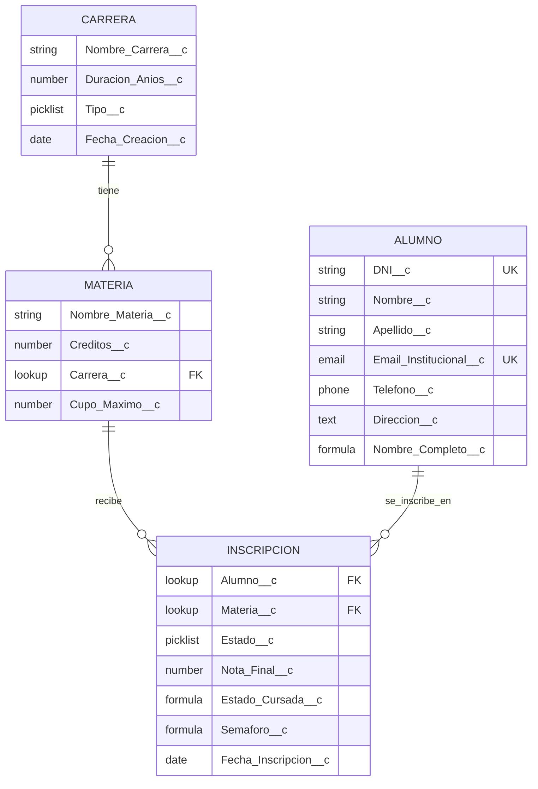

# 🗂️ Diagrama ERD: Modelo de Datos Lumina Tech

## Leyenda de Relaciones

| Relación | Tipo | Descripción |
|----------|------|-------------|
| **Carrera → Materia** | Master-Detail | Una materia pertenece a una carrera |
| **Alumno → Inscripción** | Master-Detail | Inscripción depende del alumno |
| **Materia → Inscripción** | Master-Detail | Inscripción depende de la materia |

## Leyenda de Tipos de Campo

- **string**: Texto
- **number**: Número
- **picklist**: Lista de valores
- **date**: Fecha
- **email**: Email
- **phone**: Teléfono
- **text**: Texto largo
- **lookup**: Relación (FK = Foreign Key)
- **formula**: Campo calculado
- **UK**: Unique Key (campo único)

## Validaciones Clave

1. **DNI**: Único en todo el sistema
2. **Email Institucional**: Único y formato `@lumina.edu`
3. **Nota Final**: Entre 0 y 10
4. **Estado Cursada**: Automático (Aprobado si Nota >= 6)

## Referencias

- **Guía de Objetos**: [01-Tutorial_Carrera.md](../Guias_Implementacion/01-Tutorial_Carrera.md)
- **Guía de Relaciones**: [04-Tutorial_Inscripcion.md](../Guias_Implementacion/04-Tutorial_Inscripcion.md)
- **Schema Builder**: [09-Tutorial_Schema_Builder.md](../Guias_Implementacion/09-Tutorial_Schema_Builder.md)
