# 🔄 Diagrama de Flujo: Proceso Trello (11 Columnas Estrictas)

```mermaid
%%{init: {'theme':'base', 'themeVariables': { 'primaryColor':'#fff','primaryTextColor':'#000','primaryBorderColor':'#000','lineColor':'#000','secondaryColor':'#f5f5f5','tertiaryColor':'#e0e0e0','fontSize':'13px'}}}%%
graph LR
    A["<b>1. Backlog</b><br/>(PO)"] --> B["<b>2. Sprint Backlog</b><br/>(PO)"]
    B --> C["<b>3. En Progreso</b><br/>(Admin)"]
    C --> D["<b>4. SF Desarrollo</b><br/>(Admin)"]
    D --> E["<b>5. DevOps - Dev</b><br/>(DevOps)"]
    E --> F["<b>6. SF QA</b><br/>(Tester)"]
    F -->|"❌ Bug"| C
    F -->|"✅ Pass"| G["<b>7. DevOps - QA</b><br/>(DevOps)"]
    G --> H["<b>8. Aprobación TL</b><br/>(Lead)"]
    H -->|"❌ Rechazo"| C
    H -->|"✅ Aprueba"| I["<b>9. DevOps - Prod</b><br/>(Rel. Mgr)"]
    I --> J["<b>10. SF Producción</b><br/>(Rel. Mgr)"]
    J --> K["<b>11. Terminado</b><br/>(Complete)"]
    
    classDef defaultStyle fill:#fff,stroke:#000,stroke-width:2px,color:#000
    classDef workStyle fill:#f0f8ff,stroke:#000,stroke-width:2px,color:#000
    classDef devopsStyle fill:#e6e6fa,stroke:#000,stroke-width:2px,color:#000
    classDef doneStyle fill:#e6ffe6,stroke:#000,stroke-width:2px,color:#000
    
    class A,B defaultStyle
    class C,D workStyle
    class E,G,I devopsStyle
    class F,H workStyle
    class J,K doneStyle
```

## Leyenda de Responsables (Organización Estricta)

| Columna | Responsable | Acción Principal |
|---------|-------------|------------------|
| **1. Backlog** | Product Owner (PO) | Todas las historias de usuario identificadas. |
| **2. Sprint Backlog** | Product Owner (PO) | HU seleccionadas para el sprint actual. |
| **3. En Progreso** | Salesforce Admin | Trabajo activo (Construcción). |
| **4. SF Desarrollo** | Salesforce Admin | Configuración en Sandbox (Unit Testing). |
| **5. DevOps - Dev** | DevOps Specialist | Migración/Preparación de ambiente DEV. |
| **6. SF QA** | QA Tester | Pruebas internas (Functional Testing). |
| **7. DevOps - QA** | DevOps Specialist | Migración de cambios validados a rama QA. |
| **8. Aprobación TL** | Team Lead | Revisión técnica y de estándares. |
| **9. DevOps - Prod** | Release Manager | Preparación de Change Set para PROD. |
| **10. SF Producción** | Release Manager | Despliegue final y verificación. |
| **11. Terminado** | Scrum Master | Completado y validado (Definition of Done). |

## Flujos de Retroceso

- **QA Falla** (6 → 3): Defecto encontrado, regresa a "En Progreso".
- **TL Rechaza** (8 → 3): Calidad técnica insuficiente, regresa a "En Progreso".

## Referencias

- **Guía Trello**: [00-Guia_Trello_Paso_a_Paso.md](../Archivos_intermedios/00-Guia_Trello_Paso_a_Paso.md)
- **Roles y Equipo**: [00-MATRIZ_ROLES_EQUIPO.md](../Tutoriales_por_Rol/00-MATRIZ_ROLES_EQUIPO.md)
