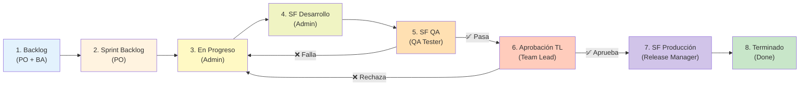

# 🔄 Diagrama de Flujo: Proceso Trello (8 Columnas)

## Leyenda de Responsables

| Columna | Responsable | Acción Principal |
|---------|-------------|------------------|
| **1. Backlog** | PO + BA | Crear y refinar HUs |
| **2. Sprint Backlog** | PO | Priorizar para el Sprint |
| **3. En Progreso** | Admin | Construir en Sandbox |
| **4. SF Desarrollo** | Admin | Entregar para testing |
| **5. SF QA** | QA Tester | Probar funcionalidad |
| **6. Aprobación TL** | Team Lead | Revisar calidad técnica |
| **7. SF Producción** | Release Manager | Desplegar a PROD |
| **8. Terminado** | Release Manager | Cerrar tarea |

## Flujos de Retroceso

- **QA Falla** (5 → 3): Bug encontrado, vuelve a desarrollo
- **TL Rechaza** (6 → 3): Problema de calidad técnica (naming, seguridad)

## Referencias

- **Manual Maestro**: [MANUAL_MAESTRO.md](../Manuales_de_Ejecucion/MANUAL_MAESTRO.md)
- **Tutorial Scrum Master**: [08-Rol_Scrum_Master.md](../Tutoriales_por_Rol/08-Rol_Scrum_Master.md)
