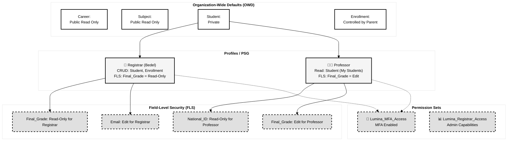

# 🛡️ Diagrama de Arquitectura de Seguridad

## Matriz de Permisos

| Objeto | Registrar (Bedel) | Professor | Justificación |
|--------|-------------------|-----------|---------------|
| **Career** | Read | Read | Información pública |
| **Subject** | Read | Read | Información pública |
| **Student** | CRUD | Read* | Bedel gestiona, Professor solo ve sus alumnos |
| **Enrollment** | CRUD | Read* | Bedel inscribe, Professor ve sus inscripciones |
| **Campo: National_ID** | Edit | Read-Only | Solo Bedel actualiza datos personales |
| **Campo: Final_Grade** | Read-Only | Edit | Solo Professor califica |

*\*Read limitado por OWD: Professor solo ve alumnos de sus materias*

## Principios de Seguridad Aplicados

### 1. **Zero Trust** (Confianza Cero)
- OWD = Private por defecto
- Acceso explícito mediante Sharing Rules o Perfiles

### 2. **Least Privilege** (Mínimo Privilegio)
- Cada perfil tiene solo los permisos necesarios
- Permission Sets para casos especiales (MFA)

### 3. **Segregation of Duties (SoD)**
- Bedel NO puede calificar
- Profesor NO puede modificar datos personales

### 4. **Defense in Depth** (Defensa en Profundidad)
- Capa 1: OWD (nivel objeto)
- Capa 2: Perfil (CRUD)
- Capa 3: FLS (nivel campo)
- Capa 4: Validation Rules (lógica de negocio)
- Capa 5: MFA (autenticación)

## Referencias

- **Guía de Seguridad**: [06-Tutorial_Seguridad.md](../Guias_Implementacion/06-Tutorial_Seguridad.md)
- **Manual Consultant**: [MANUAL_CONSULTANT.md](../Manuales_de_Ejecucion/MANUAL_CONSULTANT.md)
- **Bitácora Día 4**: [dia_4/](../Bitacoras_Sprint_1/dia_4/)
