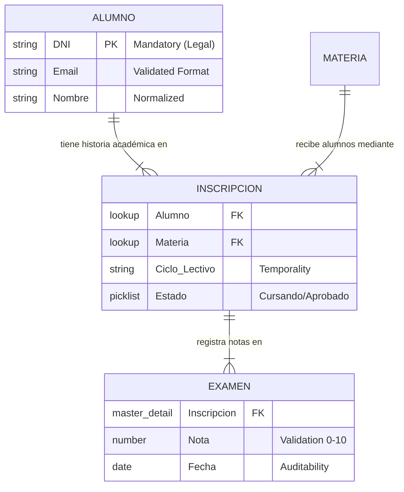

# 02-Salesforce_Consultant.md - Especificación de Arquitectura Técnica

**Proyecto**: Universidad Lumina Tech
**Rol**: Salesforce Solutions Architect
**Validación**: Basado en Entrevista Rectora Vance (19/01/2026)

---

## 🏗️ 1. Modelo de Datos Entidad-Relación (ERD)

La solución responde al requerimiento de "Estructura Académica" mediante un modelo relacional normalizado.

---

## 🧠 2. Decisiones Arquitectónicas (ADR)

### ADR-01: Arquitectura de "Inscripción" (Junction Object)
*   **Dolor Cliente**: *"No quiero escribir 'Juan Perez' veinte veces manuales."*
*   **Problema Técnico**: Redundancia de datos y falta de integridad referencial.
*   **Decisión**: Implementar `Inscripcion__c` como entidad puente con doble Master-Detail.
*   **Beneficio Directo**: El alumno se crea **una sola vez**. La inscripción solo referencia su ID. Si Juan Perez cambia de email, se actualiza en el maestro y se refleja en todas sus materias históricas y actuales.

### ADR-02: Estrategia de Seguridad "Zero Trust" (FLS)
*   **Dolor Cliente**: *"Si un administrativo cambia una nota, tenemos un problema legal grave."*
*   **Problema Técnico**: Los perfiles administrativos suelen tener privilegios elevados ("Modify All") por defecto en implementaciones rápidas.
*   **Decisión**: Implementar **Field-Level Security (FLS)** estricto en el campo `Examen__c.Nota__c`.
*   **Configuración**:
    *   `Profile: Lumina_Administrativo` -> Read Access: ✅ | Edit Access: ❌
*   **Justificación**: Esta capa de seguridad es inviolable por UI. Aunque el administrativo intente editar el registro, el campo de nota estará bloqueado a nivel de API y Base de Datos.

### ADR-03: Integridad de Datos en Origen
*   **Dolor Cliente**: *"Errores de dedo... notas de 11 o -5... emails con coma."*
*   **Problema Técnico**: "Garbage In, Garbage Out". El costo de limpiar datos es 10x más alto que prevenir el error.
*   **Decisión**:
    1.  **Validación Sintáctica**: Uso de tipo de campo `Email` estándar (RFC compliant).
    2.  **Validación Semántica**: `Validation Rule` en Examen: `Nota < 1 || Nota > 10`.
*   **Impacto**: El sistema rechaza la transacción (Atomicidad). No se guardan registros corruptos.

---

## ⚙️ 3. Especificaciones de Implementación

### Objetos (Schema)
1.  **Alumno (`Alumno__c`)**:
    *   `DNI__c`: Text(15) + Unique + Required. (Responde a: *"Dato obligatorio legal"*).
2.  **Examen (`Examen__c`)**:
    *   `Ausente__c`: Checkbox. (Responde a: *"Si el alumno falta, necesito que quede constancia"*).

### Seguridad
*   **OWD**: `Alumno` = Private. (Responde a: *"Cada profesor debe ver solo a sus alumnos"*).

