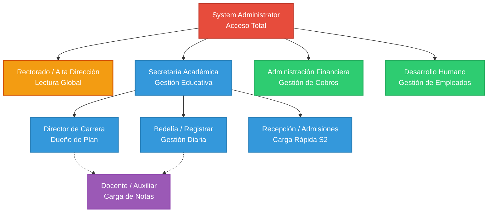

# 🔐 Guía Técnica 07.1: Tipos de Usuario, Perfiles y Seguridad (Tutorial)

**Fase**: Diseño de Seguridad y Accesos (Sprint 1 + Sprint 2)
**Rol Responsable**: 🛡️ **Salesforce Architect / Admin**
**Público Objetivo**: Administradores Junior (Manual de Configuración Core)

---

## 🏷️ Historia de Usuario

#### [HU-208] Configuración de Perfiles y Seguridad de Acceso (Lumina Tech)

*   **Trazabilidad**: Responde a **[REQ-SEC-001] Principio de Mínimo Privilegio** y **[REQ-SEC-002] Segregación de Funciones** identificados en el Sprint 2 (entrevista Rectora Vance).
*   **Descripción**: "Como **Salesforce Admin**, quiero configurar perfiles de usuario personalizados en Salesforce de forma que cada rol del personal de Lumina Tech tenga acceso **únicamente** a los objetos y campos que necesita para su función, minimizando el riesgo de exposición de datos sensibles (DNI, finanzas, calificaciones)."
*   **Criterios de Aceptación**:
    *   El sistema debe tener **6 perfiles** personalizados, ninguno con acceso total (excepto `System Administrator`).
    *   Ningún perfil académico (Bedelía, Profesor) puede ver el módulo de Cobros.
    *   Ningún perfil financiero (Tesorería) puede ver Notas ni Asistencias.
    *   El perfil Rectorado es de **solo lectura absoluta** (sin botones de creación/edición).
    *   Los perfiles docentes deben tener **Field Level Security (FLS)** que oculte DNI, teléfono y email de los alumnos.
*   **Checklist Técnico**:
    *   [ ] **Paso 0:** Activar `Enhanced Profile User Interface` en Setup → User Management Settings.
    *   [ ] **Capa Académica:**
        *   [ ] Perfil `Lumina Registrar` creado (clone de Standard User).
        *   [ ] Perfil `Lumina Director` creado (clone de Standard User) + FLS en Contact.
        *   [ ] Perfil `Lumina Admisiones` creado (clone de Standard User, acceso mínimo).
    *   [ ] **Capa Docente:**
        *   [ ] Perfil `Lumina Professor` creado (clone de Standard User) + FLS oculta DNI/Teléfono/Email.
    *   [ ] **Capa Financiero-Directiva:**
        *   [ ] Perfil `Lumina Tesoreria` creado (clone de Standard User, Full CRUD en Cobro).
        *   [ ] Perfil `Lumina Rectorado` creado (clone de **Read Only**, no de Standard User).
    *   [ ] Validación final: La pantalla de **Profiles** en Setup muestra los 6 perfiles listados.

---

## 🎓 1. Investigación y Arquitectura de Roles (As-Is & To-Be)

Antes de crear usuarios en Salesforce, es **obligatorio** configurar la Matriz de Perfiles (*Profiles*). Un Perfil define **QUÉ puede hacer** un usuario (CRUD: Crear, Leer, Editar, Borrar).
Basado en las directivas de la Ley de Educación Argentina y los descubrimientos del Sprint 2 (Rectora Vance), hemos mapeado 4 Grandes Capas de acceso regidas por el **Principio de Mínimo Privilegio**.

### 🌳 Árbol Jerárquico de Perfiles (Lumina Tech)

---

## 🛠️ 2. Guía de Implementación Paso a Paso

*Instrucciones para configurar la seguridad en la plataforma.*

### Paso 1: Preparación Crítica de la UI
Para poder ver y editar eficientemente los permisos de objetos (CRUD), debemos activar la interfaz renovada de Salesforce.
1. Ve a **Setup** (Rueda de engranaje superior derecha).
2. En el cuadro superior de Búsqueda Rápida escribe **User Management Settings**.
3. En la lista larga de opciones, busca **Enhanced Profile User Interface** (Interfaz de usuario de perfil mejorada).
4. Cambia el interruptor a **Enabled** (Activado).

---

### Paso 2: Creación de la Capa Académica (El Motor de G3/G6)
*Clonaremos el perfil "Standard User" que proporciona Salesforce y lo restringiremos según el árbol.*

#### 2.1 Lumina - Bedelía (Registrar)
*Rol: Personal operativo que inscribe alumnos. No ve dólares ni pesos.*
1. En Setup, busca **Profiles** (Perfiles).
2. Busca en la lista el perfil llamado **Standard User** (Usuario Estándar).
3. Haz clic en **Clone** (Clonar) a su izquierda.
4. **Profile Name**: `Lumina Registrar`. Haz clic en **Save**.
5. Dentro del nuevo perfil, haz clic en **Object Settings** (Configuración de objetos).
6. Ajusta los permisos CRUD entrando a cada objeto y haciendo Edit:
    *   **Contact (Persona):** ☑️ Read, ☑️ Create, ☑️ Edit. (**Sin** Delete para proteger historial).
    *   **Carrera y Materia:** ☑️ Read. (**Sin** Edit/Create. Bedelía no diseña planes).
    *   **Inscripción:** ☑️ Read, ☑️ Create, ☑️ Edit.
    *   **Cobro / Pago:** ❌ **Sin acceso** (Quita The "Read" checkbox).
    *   **Nota y Asistencia:** ❌ **Sin acceso**.

#### 2.2 Lumina - Director de Carrera
*Rol: Supervisa notas y materias de su carrera.*
1. Vuelve a **Profiles**, selecciona **Standard User** y dale a **Clone**.
2. **Name**: `Lumina Director`. **Save**.
3. En **Object Settings**, configura:
    *   **Contact (Persona):** ☑️ Read. (**Solo lectura**, no inscribe).
    *   **Carrera y Materia:** ☑️ Read, ☑️ Edit. (Solo para las que le pertenezcan).
    *   **Inscripción, Nota, Asistencia:** ☑️ Read (**Solo lectura**).
    *   **Cobro / Pago:** ❌ **Sin acceso**.
4. Haz clic en **Contact** y baja hasta ocultar con *Field Level Security (FLS)* el DNI y los teléfonos desmarcando la casilla "Read".

#### 2.3 Lumina - Recepción y Admisiones (Requerimiento Sprint 2)
*Rol: Pantalla ultrarrápida. Solo puede insertar contactos, no ver historiales.*
1. Clona **Standard User**.
2. **Name**: `Lumina Admisiones`. **Save**.
3. En **Object Settings**:
    *   **Contact (Persona):** ☑️ Read, ☑️ Create. (**Sin** Edit ni Delete).
    *   **Todos los demás objetos (Académicos y Financieros):** ❌ **Sin acceso**.

---

### Paso 3: Creación de la Capa de Aula (Cuerpo Docente)

#### 3.1 Lumina - Profesor
*Rol: Cargar asistencias y calificar. Máxima ceguera a datos privados.*
1. Clona **Standard User**.
2. **Name**: `Lumina Professor`. **Save**.
3. En **Object Settings**:
    *   **Contact (Persona):** ☑️ Read.
    *   **Carrera, Materia, Inscripción:** ☑️ Read.
    *   **Asistencia y Nota:** ☑️ Read, ☑️ Create, ☑️ Edit.
    *   **Cobro / Pago:** ❌ **Sin acceso**.
4. En Field Level Security de `Contact`, desproporciónale visión desmarcando **Reade** de `DNI__c`, Teléfonos y Correos Personales.

---

### Paso 4: Creación de la Capa Financiera y Directiva

#### 4.1 Lumina - Tesorería
*Rol: Gestión absoluta del dinero estudiantil.*
1. Clona **Standard User**.
2. **Name**: `Lumina Tesoreria`. **Save**.
3. En **Object Settings**:
    *   **Cobro / Pago:** ☑️ Read, ☑️ Create, ☑️ Edit, ☑️ Delete. (Full control).
    *   **Contact (Persona):** ☑️ Read. (Para ver quién debe).
    *   **Inscripción:** ☑️ Read. (Para saber por qué debe).
    *   **Todo el mundo académico (Carrera, Nota, Asistencia):** ❌ **Sin acceso**.

#### 4.2 Lumina - Alta Dirección (Rectorado)
*Rol: Rectores que solo entran a mirar gráficos y leer reportes (El pedido explícito del S2).*
1. Clona el perfil **Read Only** (Solo lectura) nativo de Salesforce (¡No el Standard User!).
2. **Name**: `Lumina Rectorado`. **Save**.
3. Confirma que el perfil tiene visibilidad de lectura (Read) en absolutamente todos los objetos, incluyendo los Reportes de Tesorería Académica. Carecerá totalmente de botones de "Crear" o "Guardar".

#### 4.3 SysAdmin (Sin Cambios)
Tú y el equipo técnico continúan operando transparentemente con el `System Administrator`.

---

## ✅ Lista de Verificación (Checklist del Administrador)
Al terminar esta guía, debes ingresar a la página de **Profiles** y comprobar la existencia explícita de estas 6 licencias personalizadas:

- [ ] `Lumina Registrar`
- [ ] `Lumina Director`
- [ ] `Lumina Admisiones`
- [ ] `Lumina Professor`
- [ ] `Lumina Tesoreria`
- [ ] `Lumina Rectorado`

Teniendo las "Cajas" (Perfiles) creadas, estamos listos para, en nuestra fase final, asignar usuarios (Correos electrónicos reales) dentro de estas plantillas de seguridad férrea.