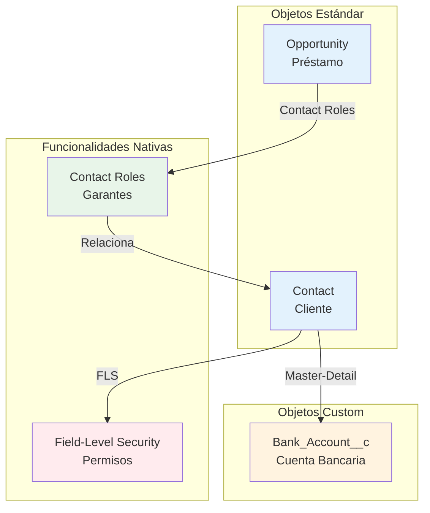

# 📊 Resumen Visual - Financiera Horizonte S.A.

## 🎯 Vista Rápida del Sprint 1

```
┌─────────────────────────────────────────────────────────────────┐
│  FINANCIERA HORIZONTE S.A. - SPRINT 1                          │
│  Objetivo: Seguridad, Gestión de Clientes y Automatización     │
└─────────────────────────────────────────────────────────────────┘

📋 Total Story Points: 16
⏱️ Duración: 2 semanas
🎯 Historias de Usuario: 3
🏷️ Épicas: 3
```

---

## 📌 Historias de Usuario

### 🔴 HU-002 | Restricción de Acceso a Datos Financieros
```
┌──────────────────────────────────────────────────────────┐
│ Prioridad: CRÍTICA ⚫                                    │
│ Story Points: 3                                          │
│ Épica: 🔴 Seguridad y Permisos                          │
├──────────────────────────────────────────────────────────┤
│ COMO: Gerente de Finanzas                               │
│ QUIERO: Restringir acceso al campo de salario           │
│ PARA: Proteger privacidad de datos financieros          │
├──────────────────────────────────────────────────────────┤
│ SOLUCIÓN:                                                │
│ • Field-Level Security (FLS)                             │
│ • Permission Sets                                        │
│ • Page Layouts por perfil                               │
├──────────────────────────────────────────────────────────┤
│ OBJETOS: Contact                                         │
│ COMPLEJIDAD: Baja                                        │
└──────────────────────────────────────────────────────────┘
```

### 🔵 HU-001 | Gestión de Garantes en Préstamos
```
┌──────────────────────────────────────────────────────────┐
│ Prioridad: ALTA 🟠                                       │
│ Story Points: 5                                          │
│ Épica: 🔵 Gestión de Clientes                           │
├──────────────────────────────────────────────────────────┤
│ COMO: Ejecutivo de Créditos                             │
│ QUIERO: Registrar múltiples garantes por préstamo       │
│ PARA: Tener trazabilidad de respaldos de crédito        │
├──────────────────────────────────────────────────────────┤
│ SOLUCIÓN:                                                │
│ • Contact Roles (nativo)                                 │
│ • Nuevo valor "Garante" en picklist                      │
│ • Page Layout personalizado                              │
├──────────────────────────────────────────────────────────┤
│ OBJETOS: Opportunity, Contact                            │
│ COMPLEJIDAD: Media                                       │
└──────────────────────────────────────────────────────────┘
```

### 🟢 HU-003 | Gestión de Múltiples Cuentas Bancarias
```
┌──────────────────────────────────────────────────────────┐
│ Prioridad: ALTA 🟠                                       │
│ Story Points: 8                                          │
│ Épica: 🟢 Automatización de Procesos                    │
├──────────────────────────────────────────────────────────┤
│ COMO: Analista de Desembolsos                           │
│ QUIERO: Registrar múltiples cuentas bancarias           │
│ PARA: Mantener historial sin perder información         │
├──────────────────────────────────────────────────────────┤
│ SOLUCIÓN:                                                │
│ • Objeto Custom: Bank_Account__c                         │
│ • Relación Master-Detail con Contact                     │
│ • Validation Rule (única cuenta primaria)                │
│ • Flow para auto-desmarcar                               │
├──────────────────────────────────────────────────────────┤
│ OBJETOS: Contact, Bank_Account__c (custom)               │
│ COMPLEJIDAD: Alta                                        │
└──────────────────────────────────────────────────────────┘
```

---

## 🏗️ Arquitectura de Solución



---

## 📊 Distribución de Story Points

```
HU-002 (Seguridad)        ███ 3 pts  (19%)
HU-001 (Garantes)         █████ 5 pts  (31%)
HU-003 (Cuentas)          ████████ 8 pts  (50%)
                          ─────────────────
                          Total: 16 pts
```

---

## 🎨 Épicas y Distribución

| Épica | Color | HU | Story Points | % del Sprint |
|-------|-------|-----|--------------|--------------|
| 🔴 Seguridad y Permisos | Rojo | HU-002 | 3 | 19% |
| 🔵 Gestión de Clientes | Azul | HU-001 | 5 | 31% |
| 🟢 Automatización | Verde | HU-003 | 8 | 50% |

---

## 🔄 Flujo de Trabajo en Trello

```
┌──────────┐   ┌──────────┐   ┌──────────┐   ┌──────────┐
│ Backlog  │──▶│  Sprint  │──▶│    En    │──▶│    SF    │
│          │   │ Backlog  │   │ Progreso │   │   Dev    │
└──────────┘   └──────────┘   └──────────┘   └──────────┘
                                                    │
                                                    ▼
┌──────────┐   ┌──────────┐   ┌──────────┐   ┌──────────┐
│Terminado │◀──│    SF    │◀──│Aprobación│◀──│    SF    │
│          │   │   Prod   │   │    TL    │   │    QA    │
└──────────┘   └──────────┘   └──────────┘   └──────────┘
```

---

## ✅ Criterios de Aceptación por HU

### HU-001: Garantes (5 criterios)
- ☐ Agregar múltiples garantes a préstamo
- ☐ Ficha completa de contacto para cada garante
- ☐ Diferenciación visual cliente/garante
- ☐ Garantes visibles en vista de oportunidad
- ☐ Reportes de préstamos con/sin garantes

### HU-002: Seguridad (5 criterios)
- ☐ Atención al Cliente NO ve salario
- ☐ Ejecutivo de Créditos SÍ ve y edita
- ☐ Gerente de Finanzas SÍ ve y edita
- ☐ Campo oculto en reportes y vistas
- ☐ Documentación de permisos

### HU-003: Cuentas Bancarias (7 criterios)
- ☐ Múltiples cuentas por cliente
- ☐ Datos completos: Banco, CBU, Tipo, Estado
- ☐ Solo UNA cuenta marcada como preferida
- ☐ Historial completo visible
- ☐ Auto-desmarcado de cuenta anterior
- ☐ Reportes de clientes con múltiples cuentas
- ☐ CBU encriptado

---

## 🛠️ Configuración Técnica Requerida

### Setup en Salesforce

```
1. SEGURIDAD (HU-002)
   ├─ Object Manager → Contact → Fields
   ├─ Monthly_Salary__c → Field-Level Security
   ├─ Permission Set: "Financial_Data_Access"
   └─ Page Layouts por perfil

2. GARANTES (HU-001)
   ├─ Object Manager → Opportunity
   ├─ Contact Roles → Agregar valor "Garante"
   └─ Page Layout → Mostrar Contact Roles

3. CUENTAS BANCARIAS (HU-003)
   ├─ Create Custom Object: Bank_Account__c
   ├─ Fields: Contact__c, Bank_Name__c, CBU__c, etc.
   ├─ Validation Rule: Única cuenta primaria
   └─ Flow: Auto-desmarcar cuentas
```

---

## 📅 Timeline Sugerido (Sprint 2 semanas)

```
Semana 1:
├─ Día 1-2: HU-002 (Seguridad) ✅ CRÍTICA
├─ Día 3-4: HU-001 (Garantes)
└─ Día 5: Testing HU-001 y HU-002

Semana 2:
├─ Día 1-3: HU-003 (Cuentas Bancarias)
├─ Día 4: Testing HU-003
└─ Día 5: Demo y Retrospectiva
```

---

## 🎯 Objetivos de Negocio Impactados

| Objetivo Estratégico | HU Relacionadas | Impacto |
|---------------------|-----------------|---------|
| Reducir tiempo de aprobación (48h → 4h) | HU-001, HU-002 | Alto |
| Centralizar información del cliente | HU-001, HU-003 | Alto |
| Visión 360 del cliente | HU-001, HU-003 | Medio |
| Mejorar retención (30% renovación) | HU-003 | Medio |

---

## 🚀 Próximos Pasos

1. ✅ Crear tablero en Trello (usar `04-Guia_Trello_Paso_a_Paso.md`)
2. ✅ Configurar las 3 tarjetas con toda la información
3. ✅ Asignar responsables del equipo
4. ✅ Mover HU-002 a "En Progreso" (prioridad crítica)
5. ✅ Configurar Sandbox de desarrollo
6. ✅ Comenzar implementación

---

## 📚 Documentos de Referencia

- [01-Caso_de_Estudio.md](./01-Caso_de_Estudio.md) - Contexto completo
- [02-Guia_Alumnos.md](./02-Guia_Alumnos.md) - Metodología
- [03-Requerimientos_SOLUCION.md](./03-Requerimientos_SOLUCION.md) - Soluciones técnicas
- [04-Guia_Trello_Paso_a_Paso.md](./04-Guia_Trello_Paso_a_Paso.md) - Implementación en Trello

---

**Sprint 1** | Financiera Horizonte S.A.  
**Curso**: Salesforce Admin + Agent Force  
**Clase**: 3 - Práctica
